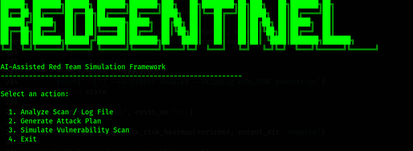
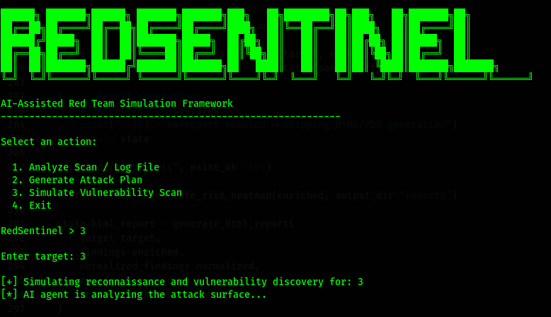

#  RedSentinel

<p align="center">
  
</p>

<p align="center">
<strong>AI‑Assisted Defensive Security Scanning & Reporting Framework</strong><br>
Educational • Research • Blue‑Team Focused
</p>

---

##  Overview

**RedSentinel** is an AI‑assisted security assessment tool that orchestrates well‑known defensive scanners, normalizes their output, enriches findings with risk context, and generates **professional‑grade HTML, PDF, and JSON reports**.

It is designed for:

* Blue teams
* Security students
* Researchers
* Defensive assessments

🚫 **No exploitation. No payloads. No intrusion.**

---

##  Tool Coverage


---

##  CLI in Action

<p align="center">
  
</p>

<p align="center">
  
</p>

---

##  Key Features

* Live execution of industry‑standard scanners
* Confidence‑weighted findings
* CVSS‑based severity scoring
* AI‑generated remediation roadmap
* Compliance mapping (OWASP, ISO 27001, PCI DSS)
* Risk heatmap visualization
* HTML, PDF & JSON reporting
* Termux‑aware execution

---

##  Example Reports

Sample reports are included in the project root:

```
reports/
├── report_karlseyra.html
├── report_karlseyra.pdf
└── report_karlseyra.json
```

These demonstrate RedSentinel’s reporting format and structure.

---

## ⚙️ Installation

### Linux / macOS

```bash
python -m venv venv
source venv/bin/activate
pip install -r requirements.txt
```

### Termux (Android)

```bash
pkg update && pkg upgrade
pkg install python git clang openssl libxml2 libxslt
pkg install nmap nikto whatweb sslscan
pip install --upgrade pip setuptools wheel
pip install -r requirements.txt
```

⚠️ **Termux Notes**

* PDF generation may be skipped
* ICMP may be restricted (nmap uses `-Pn` automatically)
* Always install tools using `pkg`, not `apt`

---

Run the interactive CLI:

```bash
redsentinel
```

Run a scan without generating reports:

```bash
redsentinel --no-report
```

Follow the interactive menu to run a scan and generate reports.

---

##  AI‑Assisted Reporting

RedSentinel uses AI to:

* Summarize technical findings
* Generate prioritized remediation steps
* Translate raw scan data into executive‑friendly language

AI output **never performs exploitation**.

---

##  Connect

* GitHub: [https://github.com/hackura](https://github.com/hackura)
* Twitter / X: [https://twitter.com/dorpe_karl](https://twitter.com/dorpe_karl)
* LinkedIn: [https://linkedin.com/in/karlseyramdorpe](https://linkedin.com/in/karlseyramdorpe)

---

## References & Citations

RedSentinel aligns with established security standards:

* **OWASP Top 10**
  [https://owasp.org/www-project-top-ten/](https://owasp.org/www-project-top-ten/)

* **NIST SP 800‑53 / 800‑61**
  [https://csrc.nist.gov/](https://csrc.nist.gov/)

* **CVSS v3.1**
  [https://www.first.org/cvss/](https://www.first.org/cvss/)

* **MITRE ATT&CK**
  [https://attack.mitre.org/](https://attack.mitre.org/)

These frameworks guide severity scoring, compliance mapping, and reporting logic.

---

## Support the Project

If RedSentinel helps you learn or work better:

* ⭐ Star the repository
* ☕ Donate: [https://buymeacoffee.com/hackura](https://buymeacoffee.com/hackura)
* Share the project
* Contribute code or documentation

---

## ⚠️ Disclaimer

RedSentinel is intended for **authorized defensive security testing only**.

You must own the target or have explicit permission before scanning.

The authors are not responsible for misuse.

---

**RedSentinel — Hackura Project**
Educational & Research Use Only

